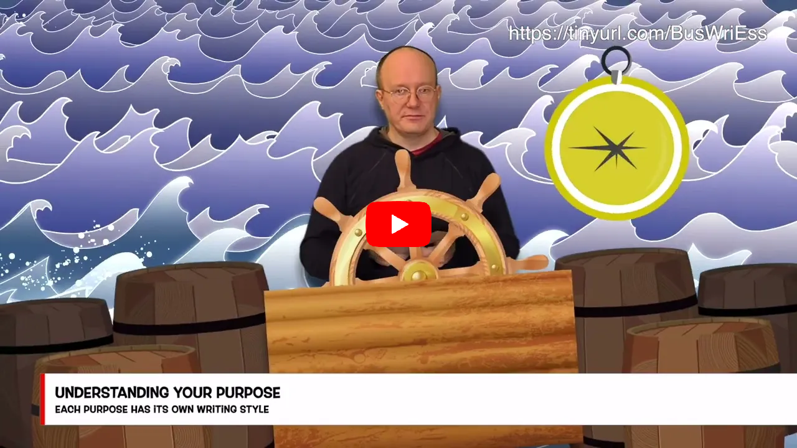

### Hello 👋

I've been writing software since I was about 12 years old, but to be frank, some of the code from those early days wasn't very good, and you've probably never used it.

Since then, I have gone through puberty. That was quite traumatic, so I'll draw a veil over the details. Then came university and a variety of jobs that mostly involved typing.

I've written a few books, including ones on [Android development](https://www.amazon.co.uk/Head-First-Android-Development-Learners/dp/149207652X/?&_encoding=UTF8&tag=dogriffiths-21&linkCode=ur2&linkId=e5561688650fb98bb9a323537d6e74b8&camp=1634&creative=6738) and [React web development](https://www.amazon.co.uk/React-Cookbook-Recipes-Mastering-Framework/dp/1492085847/?&_encoding=UTF8&tag=dogriffiths-21&linkCode=ur2&linkId=006be06c44402a4310eb7a2ee2405178&camp=1634&creative=6738).

I also give courses on the [O'Reilly Media learning platform](https://learning.oreilly.com), and I present a video course called [Business Writing Essentials](https://www.oreilly.com/videos/business-writing-essentials/0636920954453/) that will show you in 90 minutes how to go from no ideas, and a blank page, to a fully finished piece of writing.

Aside from that, I'm the founder of a [company](https://www.herescreen.com) that produces a cloud-based version of the old clocking-in and clocking-out machines, and provides development consultancy for Android and front-end web development.

I'm reasonably approachable unless it's before I've had coffee.

### Training Things

* [My courses and videos at O'Reilly Media](https://www.oreilly.com/pub/au/3371)

### Books

* [React Cookbook](https://www.amazon.com/React-Cookbook-Recipes-Mastering-Framework/dp/1492085847/)
* [Head First Android Development](https://www.amazon.com/Head-First-Android-Development-Learners/dp/149207652X/)
* [Head First Kotlin](https://www.amazon.com/Head-First-Kotlin-Brain-Friendly-Guide-ebook/dp/B07NPZ21QP/)
* [97 Things Every Java Programmer Should Know](https://www.amazon.com/Things-Every-Java-Programmer-Should/dp/1491952695/)
* [Head First C](https://www.amazon.com/Head-First-C-David-Griffiths/dp/1449399916/)
* [Head First Programming](https://www.amazon.com/Head-First-Programming-learners-programming-ebook/dp/B00CBM1WFW/)

### Social Media

 
 

